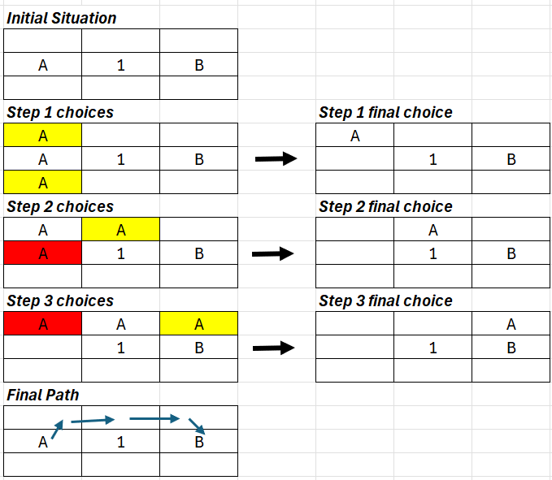

# Algorithms Used in Warehouse.xlsm

This document explains the three algorithms implemented in the VBA macro (`Module1.bas`) that power the warehouse pathfinding and route optimization.

---

## 1. A* Algorithm

Finds the shortest path between two points on the map without hitting walls.

### How It Works

```
F = G + H
```

- **G (Ground distance)**: how far we have walked from the start, cost = 1 per step
- **H (Heuristic)**: estimated distance to the target (Manhattan Distance = |RowDiff| + |ColDiff|)
- **F (Final Score)**: the sum of G and H. The cell with the lowest F score is explored next

### Example



**Initial Situation**
A is at (2,1), B is at (2,3), 1 is a wall.

**Step 1**
A tries to move right, but the wall blocks it.
A tries to move up: G = 1, H = |1-2| + |1-3| = 3, F = 1+3 = 4.
A tries to move down: G = 1, H = |3-2| + |1-3| = 3, F = 1+3 = 4.
A chooses up because it was found first.

**Step 2**
A tries to move right: G = 2, H = |1-2| + |2-3| = 2, F = 4. This ties with our best score (4), so this path is still worth exploring.
(2,1) is already visited and locked. A cannot go back.
A moves right.

**Step 3**
A tries to move right: G = 3, H = |1-2| + |3-3| = 1, F = 4. Still tied with the best score.
(1,1) is already visited. A moves right.

**Final Path**
A found B. The path is drawn.

**Backtracking**: if the path chosen at step 1 had been blocked by another wall, or if F had increased above 4, the algorithm would return to step 1 and explore the other option that also scored 4.

### How It's Used

A* is the foundation of the system. It's used in three places:

- **Drawing the route**: finds the path between each stop and draws colored arrows on the map
- **Calculating distance**: computes total walking distance when logging a transaction
- **ABC ranking**: measures how far each bin is from the dock to classify it as A, B, or C

The map grid tells A* what it can and can't walk through:
- `1` = wall (impassable)
- `2` = dock / starting point
- Empty cells = open floor
- Bin names = storage locations (walkable)

### Pros and Cons

**Advantages**: faster than checking every cell. Terrain costs can be added (e.g., walking near a zone costs more). Easy to code.
**Disadvantages**: has to remember every open option in a list. If there is a lot of empty floor, it wastes time checking every cell.
**Better alternative**: for bigger warehouses, use Jump Point Search.

---

## 2. Nearest Neighbor (Phase 1 of Route Optimization)

When a worker has multiple items to pick or put away, we need to decide what order to visit them. This is the "traveling salesperson problem" (finding the fastest route to pick all items). We solve it using a two-step strategy. Phase 1 is Nearest Neighbor.

### How It Works

Finds a quick order in which to visit locations.

**Step 1**: calculates the distance from your starting point to every item on the list.
**Step 2**: picks the location with the smallest distance.
**Step 3**: repeats the scan for the next closest location.

### How It's Used

After you confirm an order, the system reads all the bin locations from the Form and sorts them using Nearest Neighbor. Starting from the dock, it always picks the closest bin next. This gives a "good enough" initial route that Phase 2 (2-OPT) then improves.

### Pros and Cons

**Advantages**: quickly sketches a rough outline (good enough path). Easy to code.
**Disadvantages**: might grab an item close to start, but doing that puts you on the wrong side of the warehouse, forcing a long walk back later. Results in a path that crosses itself. That's why we have Phase 2.

---

## 3. 2-OPT (Phase 2 of Route Optimization)

Swaps the order of locations to see if total distance goes down. The swap is sequential (one at a time).

### How It Works

```
Initial: Start -> A -> B -> C -> D -> E -> End
Distance = 100m
```

**Step 1**: Start -> A -> C -> B -> D -> E -> End
We swap B and C. Distance = 95m. We lock in the change.

**Step 2**: Start -> A -> C -> B -> E -> D -> End
We swap D and E. Distance = 98m > 95m. We revert to step 1.

The algorithm keeps looping until no swap improves the total distance.

### How It's Used

After Nearest Neighbor builds the initial visit order, 2-OPT takes over and tries every possible pair swap. For each pair, it checks: would reversing this segment of the route make the total distance shorter? If yes, it locks in the swap and starts over. It keeps looping until no swap improves the route.

The distance comparisons use straight-line (Manhattan) distance for speed. A* runs afterward to draw the actual wall-avoiding paths.

### Pros and Cons

**Advantages**: solving the perfect route would take way too long mathematically. This makes it solvable within 1 second and gets you 95-99% of the way to the perfect route. Easy to code.
**Disadvantages**: not guaranteed to find the best route.

**Better alternative**: Lin-Kernighan (LKH). More swaps at the same time and accepts worse results in the hope of getting better ones later. This is the algorithm used by FedEx, UPS, etc.
**Why we don't use LKH**: 1 swap requires checking N^2 possibilities (for 50 items = 2,500 checks). 2 swaps = N^4 = 6,000,000. Too slow for Excel.

---

## How They Work Together

```
Form data (list of items + bins)
        |
        v
  Nearest Neighbor
  Sorts items by closest-first from dock
        |
        v
     2-OPT
  Swaps pairs to uncross the route
        |
        v
      A*
  Finds wall-avoiding path between each stop
        |
        v
  Colored arrows drawn on Map_Grid
  Total distance = steps x 0.3848m (TILE_SCALE)
```
