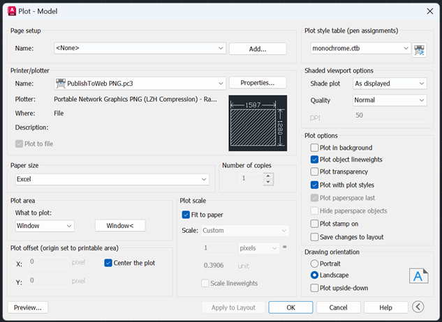

# AutoCAD to Excel: Creating a Scale Map

How the warehouse floor plan was drawn to scale in AutoCAD and transferred into Excel to enable accurate distance calculations during picking and putaway — essentially a GPS map that tells you exactly where to go and what to get.

## The Original Drawing

To access or modify the original AutoCAD drawing, open `Drawing1.dwg` from the [AutoCAD/](AutoCAD/) folder.

---

## Export Settings

### Paper Size

The goal was to export a high-resolution screenshot without distorting the scale.

| Setting | Value | Reason |
|---------|-------|--------|
| Initial attempt | Sun Hi-Res (1600 x 1280 px) | High-res preset, but aspect ratio didn't match |
| Drawing dimensions | 620" x 500" | Actual drawing size |
| Drawing ratio | 620/500 = **1.24** | Narrower than 1600/1280 = 1.25 |
| Custom paper size | **1587W x 1280H** | 1587/1280 = 1.24, matches the drawing exactly |

To create the custom paper size: Properties -> Custom Paper Sizes -> Add

### Plot Selection

What to plot? -> **Window** -> Click "Window" -> Select the entire drawing

### Lineweight Fix

When zooming out or on computers with lower-end graphics, the lines would become pixelated and some would disappear entirely. The fix was to increase the lineweight 5x (to 0.5mm):

Plot style table -> select `monochrome.ctb` -> click the printer icon next to it -> modify the lineweight

---

## Mapping the Drawing to Excel

### Making Cells Square

Before inserting the image, the Excel cells had to be converted to perfect squares: **15 height x 2.18 width**.

### Grid Dimensions

To preserve the 1.24 aspect ratio in Excel, the grid was set to **41 columns (A to AO) x 33 rows**.

| Calculation | Value |
|-------------|-------|
| 500H / 33 rows | 15.15" per row |
| 620W / 15.15 | 40.92 columns -> rounded to **41 (column AO)** |
| 41 columns / 33 rows | **1.24 ratio** (matches the drawing) |

*33 rows was chosen to fit the screen well while keeping high enough precision (lots of cells).*

### Real-World Scale

| Metric | Value |
|--------|-------|
| Width per cell | 620" / 41 = 15.12" |
| Height per cell | 500" / 33 = 15.15" |
| Average | **15.14" = 0.3848m** |

Since the cells are perfectly square, moving one cell in any direction (up, down, left, right) equals walking **0.3848 meters** in the real warehouse. This value is stored as `TILE_SCALE` in the VBA macro and is used to convert grid steps into real distances.

---

## Key AutoCAD Technique: m2p (Midpoint Between Two Points)

The most important function for making the drawing accurate was `m2p`. It finds the true midpoint between any two points, which is essential for centering objects precisely.

**How it works:**
1. Start moving an object (e.g., a rack)
2. Instead of clicking a random anchor point, type `m2p`
3. Select the two furthest points on opposite edges of the object — this snaps to its true center
4. For the destination, type `m2p` again and select the two opposite edges of the target area
5. The object drops perfectly into the center of the target

Without `m2p`, you'd have to manually eyeball the center point, which is slower and less accurate. This was critical for ensuring all racks and aisles were positioned correctly so that the distance calculations in VBA would be reliable.
