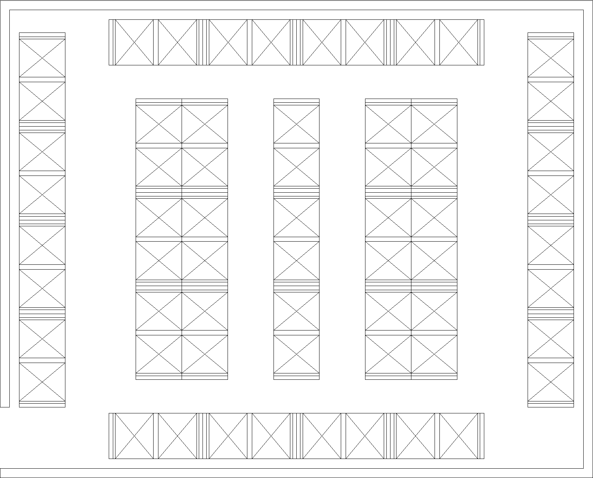

# Micro-WMS

A warehouse management system built entirely in Excel/VBA, designed for a real factory floor. It tracks inventory, assigns bin locations, optimizes picking routes, and visualizes everything on a to-scale map, all inside a single `.xlsm` file.



---

## About

While walking a factory shop floor, I noticed a section with no inventory system at all. Items were grouped by type in open squares on the floor. No tracking, no bin logic, no way to know what was where or how much was left.

Having worked in every department of a warehouse (shipping, receiving, packaging, consolidation, supervising), I knew exactly what this needed: a proper warehousing system with bin assignments, inventory tracking, and optimized pick paths.

## Why Excel?

My first instinct was Python + SQL, but the team wouldn't be able to maintain it after I left. Their daily tools were Excel and SharePoint, and they already knew VBA. So the entire system had to live in Excel: easy to use, easy to update, no external dependencies.

## Features

- **Automated bin assignment**: putaways are routed to the best available bin, with consolidation logic that fills partial bins first
- **A\* pathfinding**: finds the shortest wall-avoiding path between any two points on the warehouse map
- **Route optimization**: Nearest Neighbor + 2-OPT solve the traveling salesperson problem to minimize walking distance
- **ABC ranking**: bins are classified by distance from the dock (A = closest, C = farthest) so high-turnover items go in the best spots
- **Inventory state engine**: replays the full transaction history to rebuild current stock levels, ensuring accuracy without manual counts
- **GPS-style map**: colored arrows drawn on a to-scale warehouse grid show exactly where to go and what to pick up
- **Multi-stop support**: a single order can span multiple bins, and comma-separated locations are handled automatically
- **Capacity enforcement**: each SKU has a per-bin capacity limit, and the system prevents overfilling
- **One-click clear**: the Clear button wipes the form and map so the next order starts fresh

## How It Works

```
User fills the Form (SKU, Qty, PICK/PUTAWAY)
        |
        v
  ConfirmOperations (VBA)
    ├── Registers new SKUs (prompts for capacity)
    ├── Validates quantities against bin capacity
    ├── Consolidates into existing bins or assigns new ones
    ├── Logs to Transaction_History
    ├── Rebuilds inventory state
    └── Generates route map
        |
        v
  Colored path drawn on Map_Grid
  with total walking distance
```

The workbook has 4 sheets: **Form** (input), **Map_Grid** (visual map), **Map_Helper** (bin database + inventory), and **Transaction_History** (permanent log). All logic lives in a single VBA module.

See [Excel_Structure.md](Excel_Structure.md) for the complete sheet schemas, VBA function reference, and step-by-step screenshots.

## Algorithms

Three algorithms work together to optimize every pick/putaway route:

1. **Nearest Neighbor**: builds a quick initial route by always visiting the closest unvisited bin
2. **2-OPT**: improves the route by swapping pairs of stops until no swap reduces total distance
3. **A\***: finds the actual wall-avoiding path between each stop using Manhattan distance as the heuristic

The result is a near-optimal route calculated in under a second, with paths that respect the physical layout of the warehouse.

See [Algorithms.md](Algorithms.md) for detailed explanations with examples.

## The Map

The warehouse floor plan was drawn to scale in AutoCAD (620" x 500"), exported at a matching aspect ratio (1.24), and mapped onto a 41x33 Excel grid. Each cell represents **0.3848 meters** of real warehouse floor. This is the `TILE_SCALE` constant that converts grid steps into actual walking distance.

Bins are named by their physical position: `A3-R2-L2-A` = Aisle 3, Rack 2, Level 2, Side A.

See [AutoCAD_to_Excel.md](AutoCAD_to_Excel.md) for the full drawing-to-Excel process.

## Getting Started

1. Open `Warehouse.xlsm` and enable macros
2. Fill the **Form** sheet: enter SKU, quantity, and operation (PICK or PUTAWAY) for each line
3. Leave the Location column blank for auto-assignment, or enter a specific bin
4. Click **Confirm** to process the order: bins are assigned, inventory is updated, and a route map is generated
5. View the **Map_Grid** sheet to see the optimized walking path with colored arrows
6. Click **Clear** to reset the form and map for the next order

For a new warehouse layout, see the setup sequence in [Excel_Structure.md](Excel_Structure.md#setup-sequence-for-a-new-warehouse).

## Project Structure

```
├── Warehouse.xlsm            Main workbook (all sheets + VBA)
├── AutoCAD/                   Original AutoCAD drawing files
├── images/                    Screenshots and diagrams used in the docs
├── Algorithms.md              A*, Nearest Neighbor, 2-OPT documentation
├── AutoCAD_to_Excel.md        How the drawing became the Excel map
└── Excel_Structure.md         Sheet schemas and VBA reference
```

## Built With

- **Excel / VBA**: application logic, UI, and data storage
- **AutoCAD**: to-scale warehouse floor plan
